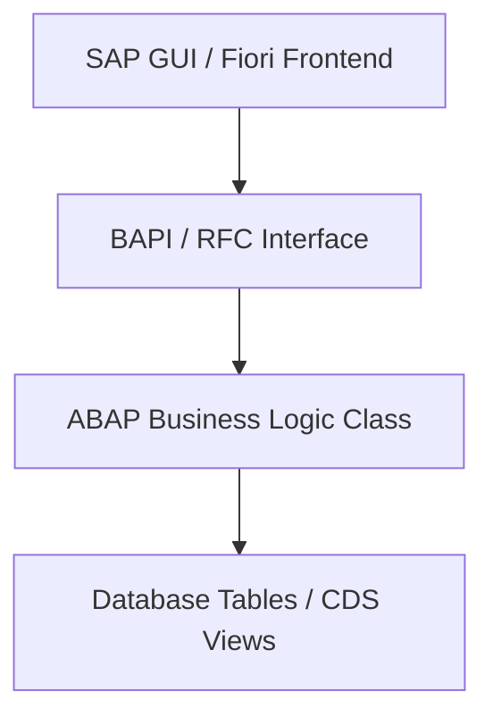
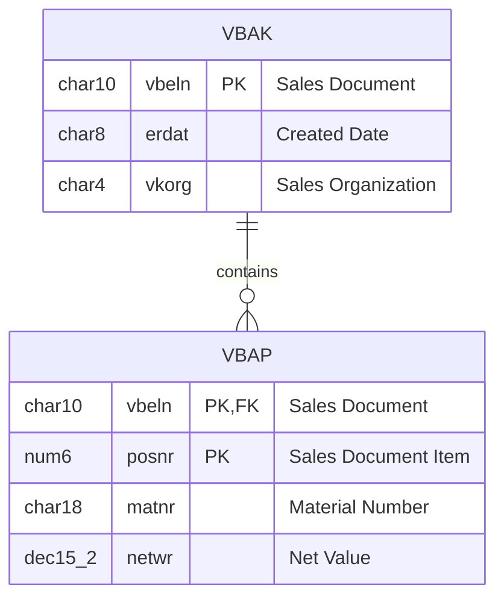
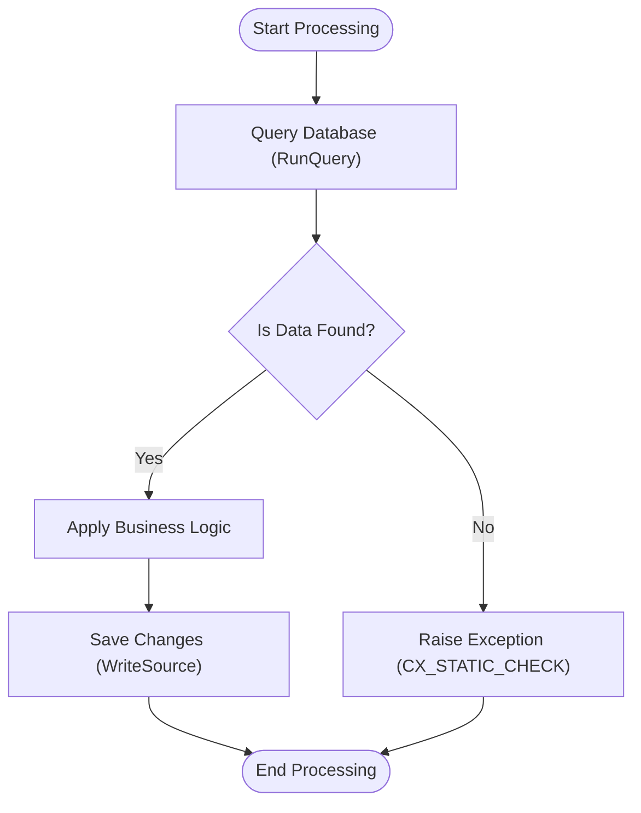

# Technical Design Document
## [REQ-NNN] [Requirement Title]

> [!NOTE]
> This document defines the technical architecture, data model, and control logic.
> **Stage 2 Owner**: Architect & DBA

### Document Metadata
- **Design Lead**: [Architect]
- **DB Lead**: [DBA]
- **Associated SRS**: [REQ-NNN: 01_srs.md](../01_srs.md)
- **Status**: DRAFT | REVIEW | APPROVED
- **Last Updated**: YYYY-MM-DD

---

## 1. System Architecture Overview

[High-level description of components, integration points, and package boundaries.]



---

## 2. Database Design (Schema & ERD)

### 2.1 Entity Relationship Diagram (ERD)
[Visualize entities and cardinality using Mermaid.js]



### 2.2 Table Schemas & Data Types
[Specify physical tables or CDS views. Map ABAP types to standard database types.]

#### Table: `ZADT_NNN_TABLE`
- **Description**: [Description]
- **Normalization Level**: 3NF (Yes / No - provide reason if No)

| Field Name | Key | Data Type | Null? | Description | ABAP Type / Element |
| :--- | :--- | :--- | :---: | :--- | :--- |
| `MANDT` | PK | `char(3)` | N | Client | `MANDT` |
| `KEY_ID` | PK | `char(10)` | N | Unique Key | `ZADT_DE_KEY` |
| `VALUE` | | `varchar(50)` | Y | Value field | `TEXT50` |

### 2.3 Proposed Indexes
- **Index Name**: `ZADT_NNN_IDX1`
  - **Fields**: `MANDT`, `VALUE`
  - **Rationale**: Optimization for search queries filtering by value.

---

## 3. Program Logic & Control Flow

### 3.1 Control Flow Diagram
[Visualize control flow logic and exception branches.]



### 3.2 ABAP Class & Interface Specifications
- **Class**: `ZCL_ADT_NNN_[NAME]`
  - **Signature**:
    ```abap
    CLASS zcl_adt_nnn_name DEFINITION PUBLIC FINAL CREATE PUBLIC.
      PUBLIC SECTION.
        METHODS process_data
          IMPORTING iv_key TYPE zadt_de_key
          RAISING cx_static_check.
      PRIVATE SECTION.
        METHODS query_database ...
    ENDCLASS.
    ```

---

## 4. Implementation Plan & Handoff

### 4.1 Pattern Selection
- **Pattern Selected**: Pattern A (Small Edit) / Pattern B (New/Rewrite) / Pattern C (Multi-Object)
- **Reason**: [e.g., Estimated changes are under 50 lines in a single class.]
- **Risk Classification**: Low / Medium / High

### 4.2 Target Objects List

| ADT Object URL | Object Type | Action | Risk |
| :--- | :--- | :--- | :--- |
| `/sap/bc/adt/...` | CLAS | Create / Edit | Low |

### 4.3 Developer Handoff Checklist
- [ ] Requirements spec (`01_srs.md`) is fully approved and signed off.
- [ ] Table definitions and keys are locked.
- [ ] Standard exception classes and logging methods are specified.
- [ ] Test keys and mock data are provided.
