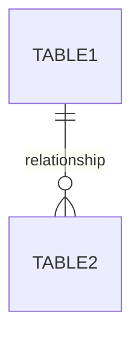
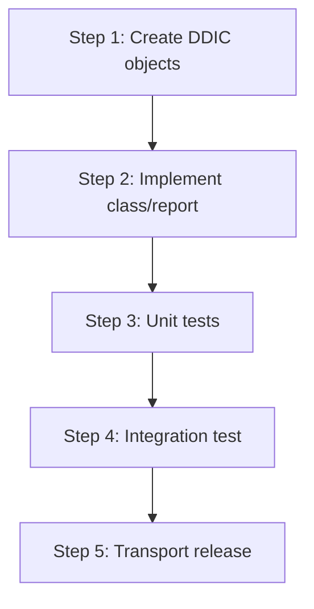

# ABAP Technical Design

**Request ID**: REQ-NNN-[slug]
**Date**: YYYY-MM-DD
**Author**: [Architect Agent]
**Status**: Draft | Approved | Implemented

---

## 1. Overview

### 1.1. Business Requirement
<!-- One-paragraph summary of the business need -->

### 1.2. Scope
<!-- In-scope and out-of-scope items -->

---

## 2. Architecture Decision

### 2.1. Pattern Selection
<!-- Pattern A: New Object | Pattern B: Enhancement | Pattern C: Refactor -->

| Criteria | Decision | Rationale |
|----------|----------|-----------|
| Pattern | | |
| Package | | |
| Transport | | |

### 2.2. Object List

| Object Type | Name | Description |
|-------------|------|-------------|
| Class/Report | | |
| CDS View | | |
| Table | | |
| Function Module | | |
| Authorization | | |

---

## 3. Database Design

### 3.1. ERD (Mermaid)

### 3.2. Table Definitions

#### Table: `[TABLE_NAME]`

| Field | Type | Key | Description |
|-------|------|-----|-------------|
| | | | |

### 3.3. Index Recommendations

| Index | Fields | Rationale |
|-------|--------|-----------|
| | | |

---

## 4. Interface Design

### 4.1. Function Modules / BAPIs

| FM Name | Import | Export | Tables | Exceptions |
|---------|---------|--------|--------|------------|
| | | | | |

### 4.2. CDS Exposure (OData)

| CDS View | Exposed As | Key Fields |
|----------|-----------|------------|
| | | |

---

## 5. Implementation Sequence

| Step | Action | Depends On |
|------|--------|-----------|
| 1 | | |
| 2 | | Step 1 |
| 3 | | Step 2 |
| 4 | | Step 3 |
| 5 | | Step 4 |

---

## 6. Quality Gates

| Gate | Check | Command |
|------|-------|---------|
| Syntax | `SyntaxCheck` | |
| Unit Test | `RunUnitTests` | |
| ATC | `RunATCCheck` | |

---

## 7. Impact Analysis

### 7.1. Affected Objects
<!-- Objects that may be impacted by this change -->

### 7.2. Regression Risk
<!-- Areas to test for regression -->

---

## 8. Open Questions

| # | Question | Resolution |
|---|----------|-----------|
| 1 | | |

---

*Generated by Architect Agent — see `docs/superpowers/specs/` for the design spec.*
