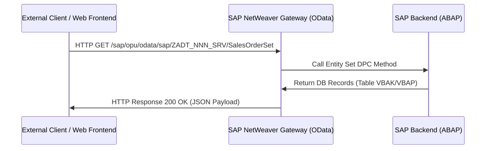

# Technical Design Document - Interface & API (OData / REST / RFC)
## [REQ-NNN] [Requirement Title]

> [!NOTE]
> This document defines the API endpoints, HTTP request/response payloads, authentication, and backend mapping.
> **Stage 2 Owner**: Interface Expert (interface-expert) & Architect

### Document Metadata
- **Interface Lead**: [Interface Expert]
- **Associated SRS**: [REQ-NNN: 01_srs.md](../01_srs.md)
- **Status**: DRAFT | REVIEW | APPROVED
- **Last Updated**: YYYY-MM-DD

---

## 1. Interface Architecture Overview

[Provide a high-level description of the integration pattern: OData Gateway service, REST endpoint, RFC Function Module, or IDoc.]



---

## 2. API Contract Specification (REST / OData)

### 2.1 Endpoint: `GET /sap/opu/odata/sap/ZADT_NNN_SRV/SalesOrderSet`
- **Description**: Retrieves a list of sales orders matching filter criteria.
- **Authentication**: Basic Auth / OAuth2 (Bearer Token)
- **HTTP Headers**:
  - `Accept`: `application/json`
  - `Content-Type`: `application/json`

### 2.2 Query Parameters

| Parameter | Type | Required? | Default | Description |
| :--- | :--- | :---: | :--- | :--- |
| `$filter` | string | N | | Filter on order fields (e.g., `Vkorg eq '1000'`). |
| `$top` | int | N | 50 | Max rows to return. |

### 2.3 Response Specification (Success - 200 OK)
```json
{
  "d": {
    "results": [
      {
        "Vbeln": "0000000001",
        "Erdat": "20260705",
        "Vkorg": "1000"
      }
    ]
  }
}
```

### 2.4 Error Specification (e.g. 400 Bad Request / 404 Not Found)
- **Status Code**: `400 Bad Request`
- **Payload**:
```json
{
  "error": {
    "code": "ZADT/400",
    "message": {
      "lang": "en",
      "value": "Invalid Sales Organization vkorg."
    }
  }
}
```

---

## 3. RFC / IDoc Interface Specification

### 3.1 RFC Function Module: `ZADT_NNN_RFC_NAME`
- **Importing Parameters**:
  - `IV_VKORG` TYPE `VKORG` (Optional)
- **Exporting Parameters**:
  - `EV_STATUS` TYPE `CHAR1`
- **Tables**:
  - `ET_SALES_ORDERS` TYPE `ZADT_NNN_T_SALES_ORDERS`

---

## 4. Implementation Plan & Handoff

### 4.1 Backend Service Objects List

| Object Name | Object Type | Action | Description |
| :--- | :--- | :--- | :--- |
| `ZADT_NNN_SRV` | ODAT | Create | SAP Gateway Service registration. |
| `ZCL_ZADT_NNN_DPC_EXT` | CLAS | Modify | Implement Entity Set CRUD methods (`SALESORDERSET_GET_ENTITYSET`). |

### 4.2 Developer Handoff Checklist
- [ ] API JSON/XML payload schemas are approved.
- [ ] HTTP status codes and custom error namespaces are finalized.
- [ ] Gateway service registry is verified and active on staging.
