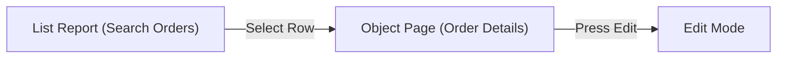

# Technical Design Document - Fiori / UI5 Frontend
## [REQ-NNN] [Requirement Title]

> [!NOTE]
> This document defines the UX/UI floorplans, component hierarchy, controller bindings, and client-side logic.
> **Stage 2 Owner**: Fiori Developer (fiori-developer) / UX Designer

### Document Metadata
- **UX/UI Design Lead**: [Fiori Developer]
- **Associated SRS**: [REQ-NNN: 01_srs.md](../01_srs.md)
- **Status**: DRAFT | REVIEW | APPROVED
- **Last Updated**: YYYY-MM-DD

---

## 1. UX / UI Specification

### 1.1 Fiori Floorplan Selection
- **Floorplan Chosen**: [e.g., Worklist / List Report / Object Page / Flexible Column Layout / Custom Freestyle]
- **Rationale**: [Describe why this floorplan was selected based on user needs]

### 1.2 Target Personas & Navigation
- **Persona**: [e.g., Sales Manager]
- **Entry Point / Tile**: [e.g., Fiori Launchpad Group "Sales", Tile "Manage Sales Invoices"]
- **Navigation Flow**:

---

## 2. Component & UI Architecture

### 2.1 View & Controller Hierarchy
[Describe the view hierarchy and controller responsibilities.]
- `App.view.xml` (Root View)
  - `Main.view.xml` (Search and List view)
  - `Detail.view.xml` (Detail and edit view)

### 2.2 Model & Data Binding
- **Primary OData Service**: `/sap/opu/odata/sap/ZADT_NNN_SRV/`
- **Entity Set Bindings**:
  - Main Table: `/SalesOrderSet` (Binding mode: OneWay / TwoWay)
  - Details Form: `/SalesOrderSet('{vbeln}')`

---

## 3. UI5 Control Layout & Custom Extensions

### 3.1 Naming Conventions & Control IDs
- Table Control ID: `salesOrderTable`
- Search Field Control ID: `salesOrderSearchField`

### 3.2 Mock Data & Extension Points
- **Mock JSON Path**: `webapp/localService/mockdata/SalesOrderSet.json`
- **Custom Controls / Fragments**: [Describe any custom UI5 controls or reusable XML fragments used]

---

## 4. Implementation Plan & Handoff

### 4.1 UI5 Tech Stack & Version
- **UI5 Version**: SAPUI5 v1.96 / v1.108
- **UI5 Tooling**: SAP Fiori Tools / UI5 CLI
- **Language**: JavaScript / TypeScript

### 4.2 Webapp Directory File Changes List

| File Relative Path | File Type | Action | Description |
| :--- | :--- | :--- | :--- |
| `webapp/manifest.json` | JSON | Modify | Register new route, target, and i18n models. |
| `webapp/view/Main.view.xml` | XML | Modify | Add search table and buttons. |
| `webapp/controller/Main.controller.js` | JS | Modify | Implement row selection and search filters. |

### 4.3 Developer Handoff Checklist
- [ ] Figma/Axure UI mockups are reviewed and attached.
- [ ] OData Metadata and Entity Sets are validated and active.
- [ ] Custom CSS or icons are approved and documented.
