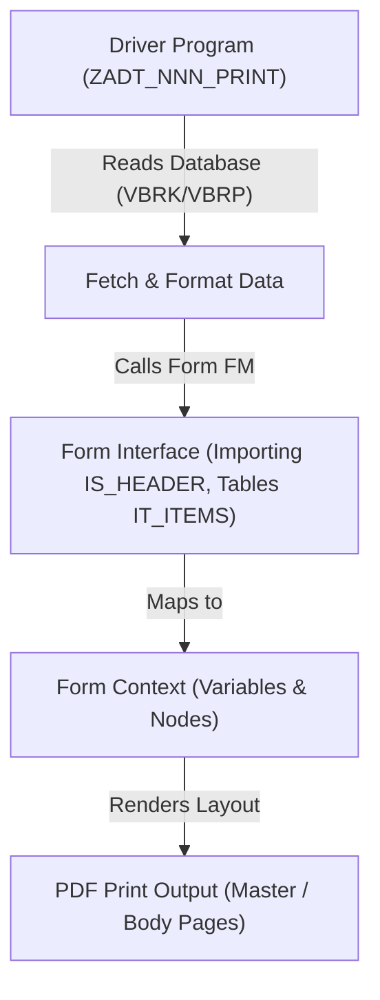

# Technical Design Document - SAP Forms (Smart / Adobe Forms)
## [REQ-NNN] [Requirement Title]

> [!NOTE]
> This document defines print programs, form layouts, master/body pages, and data mapping.
> **Stage 2 Owner**: Form Expert (form-expert) & Architect

### Document Metadata
- **Form Design Lead**: [Form Expert]
- **Associated SRS**: [REQ-NNN: 01_srs.md](../01_srs.md)
- **Status**: DRAFT | REVIEW | APPROVED
- **Last Updated**: YYYY-MM-DD

---

## 1. Form Overview

- **Form Name/ID**: `ZADT_NNN_FORM`
- **Form Technology**: Smart Forms / Adobe Forms (PDF-based print forms)
- **Description**: [e.g., Customer Invoice PDF generated upon billing release]
- **Related Transaction**: [e.g., VF03 / VF01]
- **Standard Driver Program**: [e.g., RLVSDRHP / RVADRVAL]
- **Custom Driver Program**: `ZADT_NNN_PRINT`

---

## 2. Form Interface & Data Retrieval

### 2.1 Interface Parameters (Form Signature)
[Document the key import/export parameters of the form interface.]
- **Importing**:
  - `IS_HEADER` TYPE `ZADT_S_FORM_HEADER` (Invoice header data)
- **Tables / Collections**:
  - `IT_ITEMS` TYPE `ZADT_T_FORM_ITEMS` (Invoice item rows)

### 2.2 Data Mapping Flow

---

## 3. Layout & Page Design

### 3.1 Page Hierarchy (Adobe Forms / Smart Forms tree)
- **Master Page (`MASTER_PAGE`)**: Contains static header (Logo, Company Address) and static footer (Page Numbering, legal text).
- **Body Page (`BODY_PAGE`)**:
  - **Subform `HeaderInfo`**: Positioned (fixed width) containing billing address, invoice ID, and date.
  - **Subform `ItemsTable`**: Flowed (dynamic height) containing table header, data rows, and totals.
  - **Subform `PaymentTerms`**: Positioned containing bank detail text blocks.

### 3.2 Calculations & Conditions within Form Layout
- **Subtotal/Total Net Value**: Computed in the context/layout script (JavaScript/FormCalc) or passed pre-calculated from the driver program (Preferred).
- **Tax percentage block**: Condition node in Smart Form (Node `TAX_BLOCK` active only if `IS_HEADER-TAX_VAL > 0`).

---

## 4. Implementation Plan & Handoff

### 4.1 Form Objects List

| Object Name | Object Type | Action | Description |
| :--- | :--- | :--- | :--- |
| `ZADT_NNN_FORM` | SFPF (Adobe Form) / SSFO (Smart Form) | Create | Invoice Form layout and context mapping. |
| `ZADT_NNN_PRINT` | PROG | Create | Print program driver for fetching data and calling the form. |

### 4.2 Developer Handoff Checklist
- [ ] Printer layout mockup (PDF/A compatible) is attached and approved.
- [ ] Form interface fields match driver program structures field-by-field.
- [ ] Output device (Spool printer configuration) is verified on SAP NetWeaver.
- [ ] Standard fonts (e.g., Arial, Courier) are confirmed to exist on the ADS (Adobe Document Services) server.
